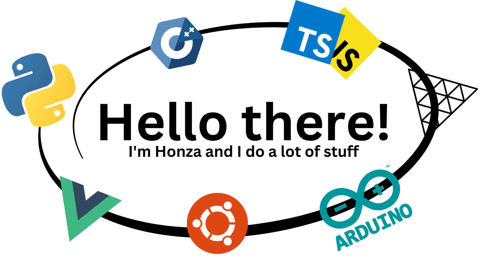

</a>

# About me:
Hi I'm Honza (EN: John), I'm a guy that always loved to create and invent new things, it didn't matter if it was a lego, sand or piece of paper and glue, I always enjoyed the feeling of creating something. Sometime around when I was 10 I found my way to programming through lego mindstorms that my parents got me for birthday. After that I got into web development and learned basics of html, css and javascript. Since then I learned Vue, Docker, C++ and other stuff, but __the main thing I learned was how to teach my self new stuff__ this was the biggest step in my life as a programmer. Right now I'm studying robotics and can't wait to start working and put my skills into use.

❤️

_"ChatGPT is the next google and way more..."_

# My skills:
**Web development:**

	
     

**Iot:**

	    

**Other:**

    Fusion 360 (3D modeling), 3D printing, discord.js

